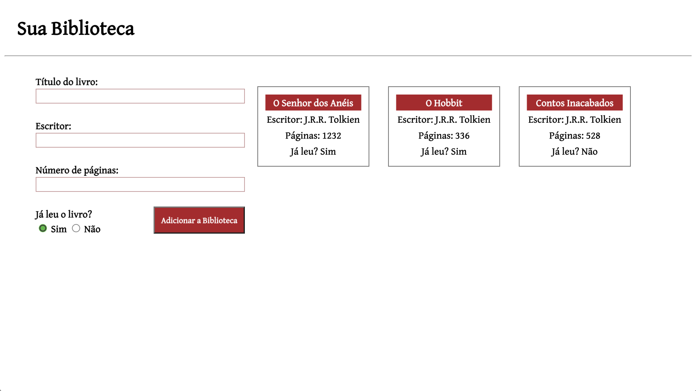
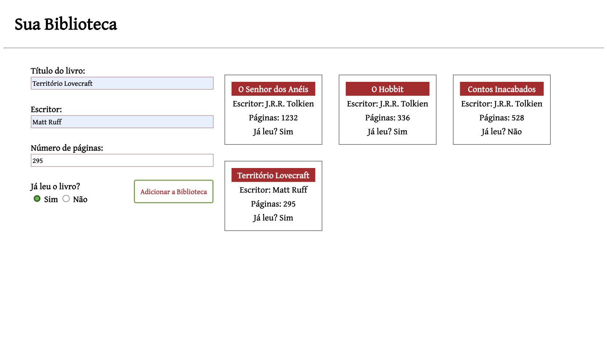

# Biblioteca (library)

## Table of contents

- [Overview](#overview)
  - [The challenge](#the-challenge)
  - [Screenshots](#screenshots)
  - [Links](#links)
- [My process](#my-process)
  - [Built with](#built-with)
  - [What I learned](#what-i-learned)
  - [Continued development](#continued-development)
  - [Useful resources](#useful-resources)
- [Author](#author)

## Overview

### The challenge

Users should be able to:

- Add some book characteristics;
- Choose the status of the book (read or not);
- See the books added in the page.

### Screenshots




### Links

- Solution URL: [GithHub Repository](https://github.com/danielrsouza10/library)
- Live Site URL: [Interactive Rating Component](https://danielrsouza10.github.io/library/)

## My process

### Built with

- Semantic HTML5 markup
- CSS custom properties
- Flexbox
- Javascript Objects and Constructors

### What I learned

Making use of objects and constructors in JavaScript.

```js
function Book(title, author, pages, read) {
  this.title = title;
  this.author = author;
  this.pages = pages;
  this.read = read;
}

function addToLibrary(title, author, pages, read) {
  //a function that do library.push
  let book = new Book(title, author, pages, read);
  library.push(book);
  queue = book;
}
```

```js
//a function to show all the books insert by default in the script
function showLibrary() {
  library.forEach((element) => {
    const list = document.querySelector("#card-container");
    const book = document.createElement("table");
    const titleBook = document.createElement("th");
    const authorBook = document.createElement("tr");
    const pagesBook = document.createElement("tr");
    const readBook = document.createElement("tr");

    titleBook.innerText = element.title;
    authorBook.innerText = "Escritor: " + element.author;
    pagesBook.innerText = "Páginas: " + element.pages;
    readBook.innerText = "Já leu? " + element.read;

    list.appendChild(book);
    book.appendChild(titleBook);
    book.appendChild(authorBook);
    book.appendChild(pagesBook);
    book.appendChild(readBook);
  });
}
```

### Continued development

Time to star doing projects in Angular and TypeScript.

### Useful resources

- [The Odin Project](https://www.theodinproject.com) - This helped me for Objects and constructors.

## Author

- Website - [Linkedin](https://www.linkedin.com/in/danielrsouza/)
- Instagram - [@danielrsouza](https://www.instagram.com/danielrsouza)

This is a solution to the [Library](https://www.theodinproject.com/lessons/node-path-javascript-library).
